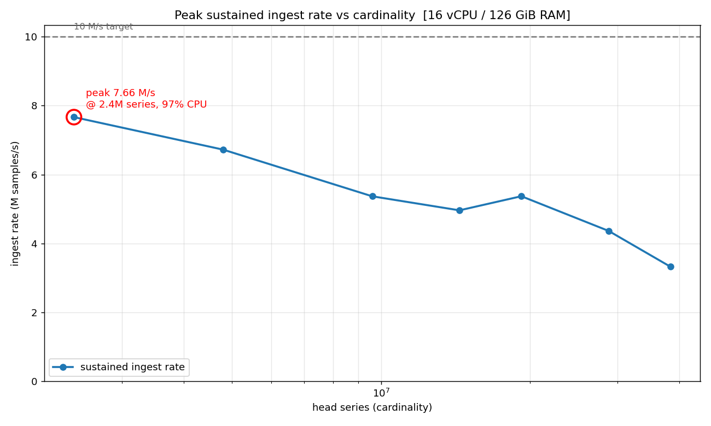
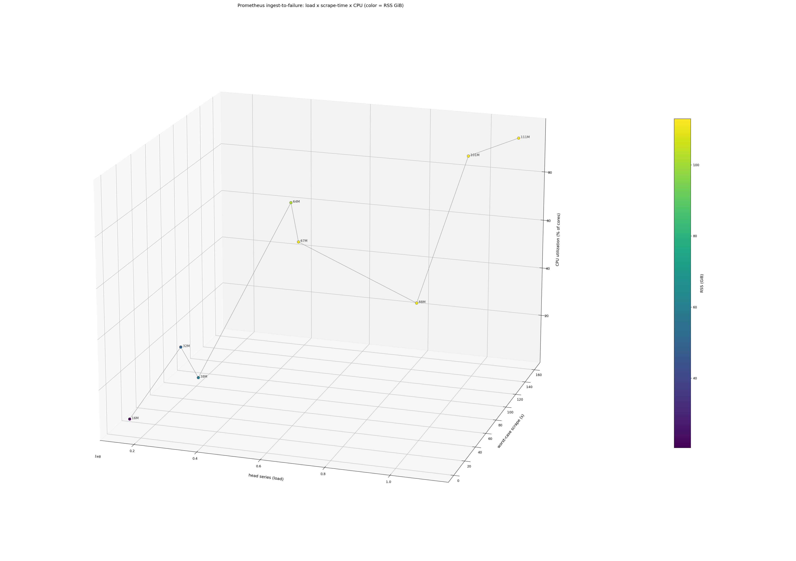
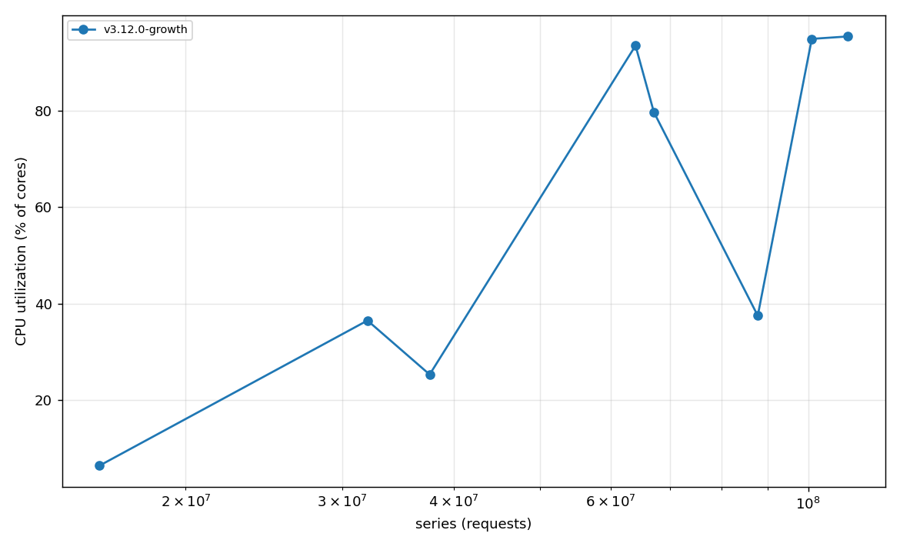
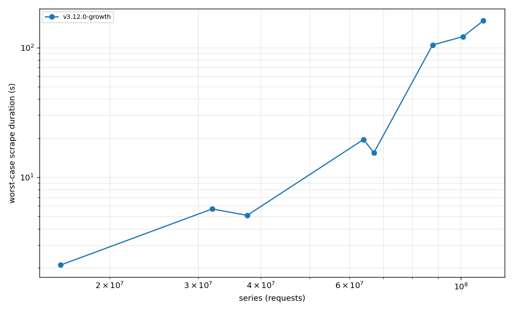
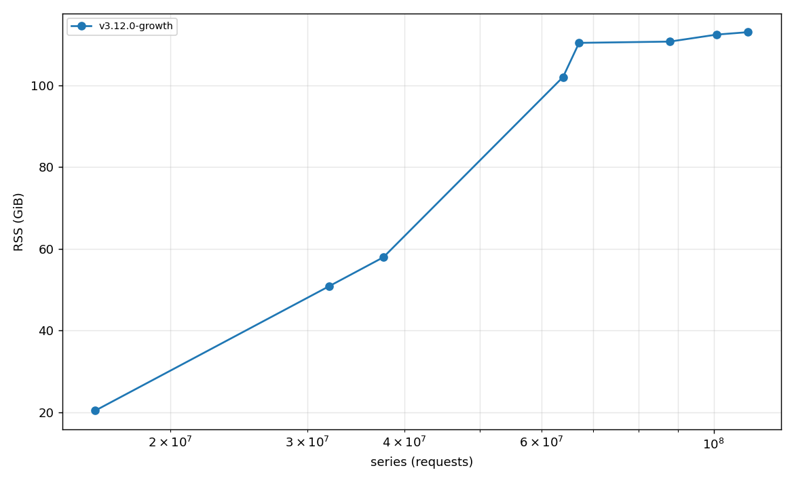
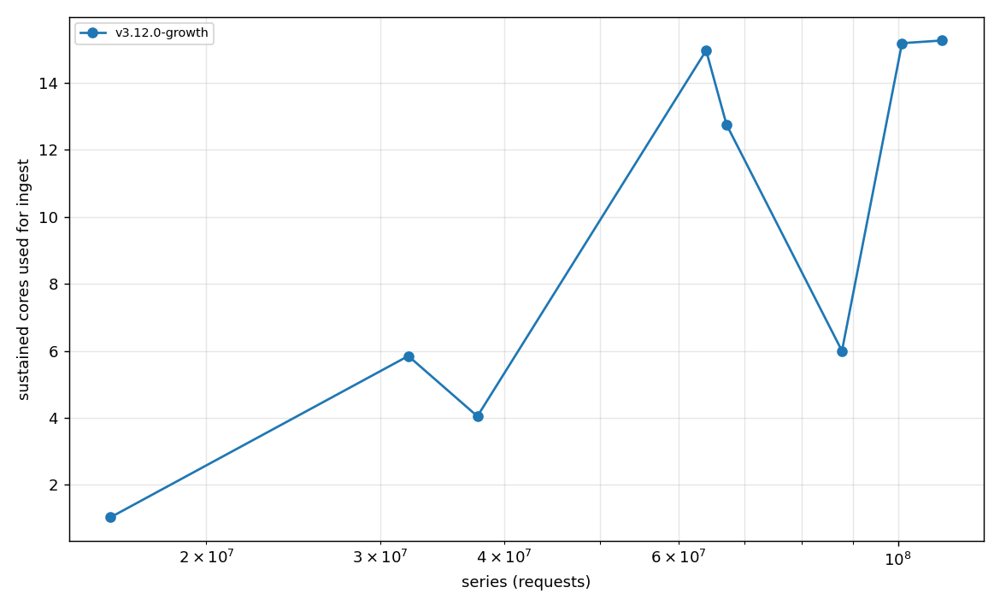

# Results — Prometheus Ingest to Failure

Host: `ubuntu-m-16vcpu-128gb-sfo3` — Intel Xeon Gold 6248, **16 vCPU**, **128 GB** RAM
(no swap), Ubuntu 24.04.3. Methodology and terminology: see [README](README.md).

## TL;DR

- **Peak sustained ingest ≈ 7.7M samples/s** on this 16-vCPU box — about **77% of a
  10M samples/s target**, and it is **CPU-bound** (96% of cores at the peak). No
  config reached 10M/s.
- **The failure is performance collapse, not OOM.** A single Prometheus server can
  *hold* 100M+ active head series in RAM (~113 GiB), but by then a scrape takes
  **2+ minutes** — it failed long before the memory ceiling.
- **For the original 1 s scrape interval, the ceiling is ~300K series per target**
  (≈5M total across 16 targets) — three orders of magnitude below 100M.
- **Ingest is parallel up to one scrape per core.** With 16 targets on 16 cores,
  sustained ingest reaches **~15 of 16 cores** at high cardinality.
- **Per-sample CPU cost rises with cardinality** — ~2.1 → ~4.6 cpu-seconds per
  million samples from 16M → 64M series (larger index, cache misses, GC).
- **Memory ≈ 1.4–1.6 KB per head series.**

## Peak ingest rate — the 10M samples/s question

Ingest **rate** (samples actually appended per second) is a different axis from
cardinality. We swept it directly: 24 targets on 16 cores (more targets than cores
so every core always has a warm scrape queued), and at each cardinality the scrape
interval is auto-tightened toward the back-to-back regime so the box runs flat-out
without scrapes timing out. Rate is read from
`prometheus_tsdb_head_samples_appended_total{type="float"}` — samples *committed*,
not nominal `series/interval`.

| Head series | **Ingest rate** | CPU util | RSS | note |
|---:|---:|---:|---:|:--|
| 1.8M | 7.06 M/s | 96% | 4.1 GiB | CPU-saturation knee |
| **2.4M** | **7.66 M/s** | **97%** | **4.0 GiB** | **peak** |
| 4.8M | 6.72 M/s | 91% | 8.9 GiB | |
| 9.6M | 5.37 M/s | 98% | 18.3 GiB | |
| 14.4M | 4.96 M/s | 98% | 28.1 GiB | |
| 19.2M | 5.37 M/s | 89% | 37.0 GiB | |
| 28.8M | 4.36 M/s | 68% | 57.3 GiB | scrape-contention thrash above this |
| 38.4M | 3.32 M/s | 86% | 85.0 GiB | |

**Peak = 7.66M samples/s at ~2.4M series, 97% CPU, 4 GiB.** Three things to read off
this:

- **It's CPU-bound, not memory-bound.** At the peak the box uses 4 GiB of 126 —
  memory is irrelevant here. All 16 cores are pegged. The ceiling is
  `cores ÷ cpu-per-sample`: at the cheapest (low-cardinality) per-sample cost of
  ~2.1 µs, that's `16 / 2.1µs ≈ 7.6M/s`, exactly what we measured.
- **Rate *falls* as cardinality grows** because per-sample cost rises (larger index,
  cache misses scanning millions of scattered series, GC). So you cannot buy more
  rate by adding series — the opposite.
- **Over-packing scrapes backfires.** At 28.8M, forcing back-to-back scrapes (98%
  CPU) gave *less* throughput (3.5M/s) than moderate spacing (4.36M/s at 68% CPU):
  24 concurrent multi-second scrapes thrash 16 cores' caches. Peak throughput is not
  always at 100% CPU.

Below ~1.8M series the box can't be saturated at a sane interval (too few series to
fill the cores), so those points are floor-limited, not a real rollover.

**Why no config hit 10M/s:** the binding limit is **per-core sample-append CPU**
(~300–600K samples/s/core in the real scrape→parse→append→WAL path). Sixteen cores
puts the ceiling at ~7–8M/s for this workload — 10M/s would need either ~30% faster
per-core append, more cores, or cheaper samples than one float per series. It was
**not** memory capacity, memory bandwidth, or lock contention (the TSDB head's
sharded stripe locks scaled cleanly to ~15/16 cores; the limiter is per-sample CPU
work plus cache-miss latency at high cardinality).

## The state space (load × scrape-time × CPU, color = RSS)

One growth run as a trajectory: **X = head series** (load), **Y = worst-case scrape
duration** (the failure signal), **Z = CPU utilization** (% of 16 cores), **color =
RSS**. It starts cheap (16M: ~2 s scrape, 6% CPU, 20 GiB) and climbs in CPU and
memory, then — past ~64M — turns and shoots out along the scrape-duration axis into
the failure zone (88M→111M at 100–160 s scrapes, ~95% CPU, ~110 GiB) before the OOM
kill. CPU utilization (clean on every row) saturates toward ~95%:

## How "ingest CPU" is measured

One Prometheus server scrapes 16 synthetic exporters (one **target** per core, all
16 cores shared). Each exporter serves a precomputed payload (~0 CPU), so CPU read
from Prometheus' own `process_cpu_seconds_total` is pure ingest. The head is grown
in place (exporters resized via `/resize`) so cardinality climbs monotonically.

## v3.12.0 — growth to failure (16 targets, 16 cores, 30 s scrape interval)

| Head series | Sustained CPU | cpu-s / 1M samples | Worst scrape | RSS | State |
|---:|---:|---:|---:|---:|:--|
| 16.0M | 1.03 cores (6%) | 2.12 | 2.1 s | 20.4 GiB | ✅ healthy |
| 32.0M | 5.85 cores (37%) | 2.68 | 5.7 s | 50.9 GiB | ✅ healthy |
| 64.0M | 14.97 cores (94%) | 4.58 | 19.5 s | 102.0 GiB | ⚠️ marginal (scrape = 65% of interval) |
| ~88M | — | *(creation-bound)* | **104.6 s** | 110.7 GiB | ❌ collapsed |
| ~101M | — | *(creation-bound)* | **121.5 s** | 112.4 GiB | ❌ collapsed |
| ~111M | — | *(creation-bound)* | **160.9 s** | 113.0 GiB | ❌ collapsed |
| ~110–144M | — | — | — | **OOM-killed** | 💀 crash |

The CPU/sample column is only meaningful where the head reached a clean plateau
(16/32/64M); past that, series creation never finished inside a step, so those rows
are creation-bound (samples don't commit until a scrape ends, and scrapes ran
30–160 s). The **scrape-duration and RSS columns are valid throughout** and tell the
real story.

Worst-case scrape duration is flat-ish (≤6 s) to 32M, ~20 s at 64M, then goes
near-vertical: **104 s → 121 s → 161 s**. That is the failure — no usable scrape
interval can absorb it. RSS, by contrast, climbs almost linearly (`~1.4–1.6 KB ×
series`) right up to the OOM kill at ~113 GiB.

### The usable ceiling vs the OOM ceiling

| Scrape interval you want to sustain | Max series before scrape > interval |
|---|---|
| **1 s** (the original target) | **~5M total** (~300K/target × 16) |
| 15 s | ~50M |
| 30 s | ~64M (marginal), hard fail by ~88M |
| (memory only, ignoring usability) | ~110M → OOM at ~113 GiB |

## Strict 1 s interval — the scrape-timeout wall

Cold runs at a strict 1 s scrape interval (`scrape_timeout ≤ scrape_interval`):

| Setup | Creation scrape | Sustains 1 s? |
|---|---:|:--|
| 1 target × 100K | 0.11 s | ✅ |
| 1 target × 300K | 0.50 s | ✅ |
| 1 target × 400K | 2.06 s | ❌ |
| 4 targets × 100K (=400K) | 0.15 s | ✅ |

A **single** target tops out at **~300K series** at 1 s; adding targets scales the
ceiling roughly linearly with core count (one scrape per core), so ~16 targets give
~5M total at 1 s. Beyond that the scrape can't complete within the interval.

## Answering the original question

> "ingest increasing up to 100,000,000 metrics at one second scrape interval … test
> to failure … how much CPU for ingest alone."

- **100M series at 1 s is not remotely feasible** on this hardware — it's not even
  feasible at 30 s. 100M series is reachable only as a raw in-memory count, with
  scrapes taking minutes, just under the OOM line.
- **CPU for ingest alone:** ingest parallelizes to ~all 16 cores; the
  interval-independent cost is **~2–5 cpu-seconds per million samples**, rising with
  cardinality. At a healthy 32M series it sustains ~6 cores; at 64M ~15 cores.
- **Failure point:** performance collapse (scrape duration ≫ interval) around
  **64–88M series at a 30 s interval**, or **~5M at the requested 1 s interval** —
  both far below the ~110M OOM point.

## Caveats / next steps

- The 30 s interval leaves the CPU duty cycle idle at low cardinality, so per-step
  series creation contaminates the high-cardinality CPU rows. A **tight-interval
  pass** (`interval ≈ scrape_duration`, no idle) would give a clean sustained-CPU
  curve at every cardinality.
- Values are constant per series (best-case chunk compression); real churn/value
  variation would raise CPU and RSS somewhat.
- **apt 2.45.3** comparison run pending.
